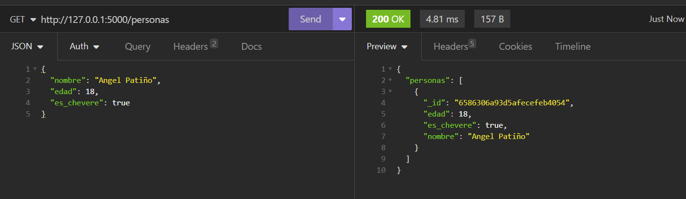

# Proyecto Flask para Gestión de Personas

Este proyecto implementa una API simple utilizando Flask para gestionar información sobre personas. Permite operaciones básicas como obtener la lista de personas, recuperar información sobre una persona por su ID, agregar una nueva persona, actualizar la información de una persona y eliminar una persona por su ID.

**Seleccionar Idioma:**
- [Español](README-es.md)
- [Inglés](README.md)

## Resultados
### Iniciar Docker 
 
### Obtener Lista  
 
### Obtener por ID
 
### Agregar   
 
### Actualizar 
 
### Eliminar 
 
### Docker MongoDB 
 
### Docker Aplicación 
 


## Estructura del Proyecto

- **app.py**: Contiene el código principal de la aplicación Flask.
- **Dockerfile**: Define la configuración para construir la imagen Docker de la aplicación.
- **requirements.txt**: Enumera las dependencias de Python necesarias para la aplicación.

## Uso

### Requisitos Previos

- Docker instalado en el sistema.

### Construir y Ejecutar la Aplicación

1. Construir la imagen Docker:

   ```bash
   docker build -t API-REST-Flask-Docker-MongoDB .
   ```

2. Ejecutar el contenedor:

   ```bash
   docker run -p 5000:5000 API-REST-Flask-Docker-MongoDB
   ```

La aplicación estará disponible en [http://localhost:5000](http://localhost:5000).

## Endpoints de la API

### Obtener Todas las Personas

- **URL**: `/personas`
- **Método**: `GET`
- **Descripción**: Devuelve la lista de todas las personas registradas.

### Obtener Persona por ID

- **URL**: `/personas/<int:id>`
- **Método**: `GET`
- **Descripción**: Devuelve información sobre una persona específica según su ID.

### Agregar Nueva Persona

- **URL**: `/personas`
- **Método**: `POST`
- **Descripción**: Agrega una nueva persona utilizando la información proporcionada en el cuerpo de la solicitud.

### Actualizar Persona por ID

- **URL**: `/personas/<int:id>`
- **Método**: `PUT`
- **Descripción**: Actualiza la información de una persona específica según su ID, utilizando la información proporcionada en el cuerpo de la solicitud.

### Eliminar Persona por ID

- **URL**: `/personas/<int:id>`
- **Método**: `DELETE`
- **Descripción**: Elimina a una persona según su ID.

## Dockerfile

El Dockerfile construye la imagen Docker para la aplicación. Instala las dependencias especificadas en el archivo `requirements.txt` y expone el puerto 5000, que es el puerto por defecto en el que Flask se ejecuta.

## Notas

- La aplicación se ejecuta en modo de depuración (`debug=True`) para facilitar el desarrollo. En un entorno de producción, este valor debería establecerse en `False`.
- La aplicación escucha en todas las interfaces (`host='0.0.0.0'`) para permitir conexiones externas al contenedor Docker.

¡Disfruta explorando y trabajando con la API de Gestión de Personas!
